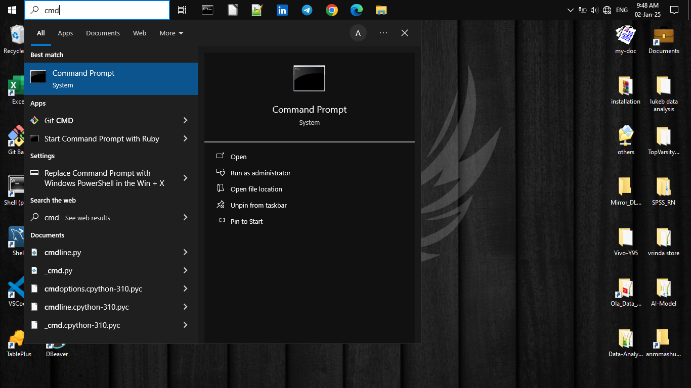
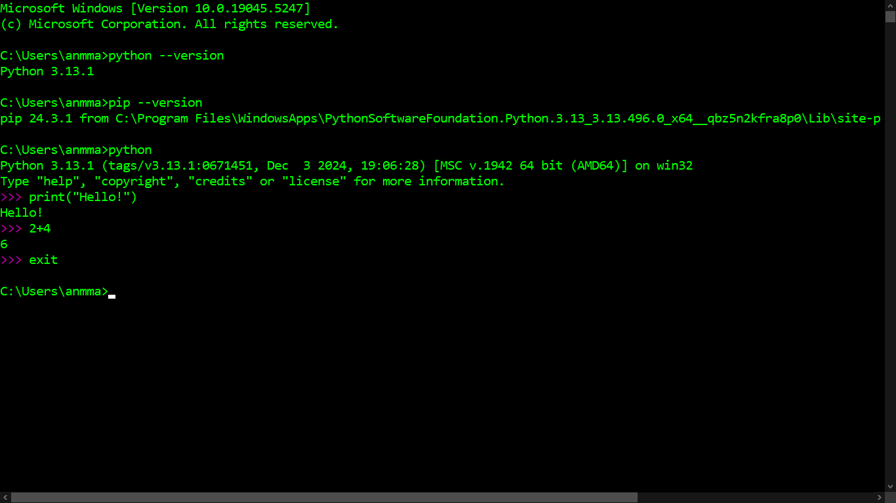

## How to Install Python on Windows

Python is a powerful and versatile programming language widely used for data analysis, web development, automation, and more. In this guide, we will walk you through the process of installing the latest version of Python on Windows.

### **Step 1: Download Python**

1. Download the latest Python installer for Windows from the official website: [Python 3.13.1](https://www.python.org/ftp/python/3.13.1/python-3.13.1-amd64.exe).
2. If the direct link doesn’t work, visit the [official Python website](https://www.python.org), navigate to the **Downloads** section, and select the version suitable for your system.

### **Step 2: Run the Installer**

1. Once the installer is downloaded, open the **Downloads** folder and locate the `.exe` file.
2. Double-click the file to start the installation process.
3. Choose **Install Now** for the default settings, or select **Customize Installation** to adjust advanced options if necessary.

### **Step 3: Verify Installation**

1. After installation is complete, open **Command Prompt**:
   - Press `Win + R`, type `cmd`, and hit Enter.
   - Alternatively, search for "cmd" in the Windows search bar and press Enter.
2. Check that Python is installed correctly by typing the following command:

```shell
python --version
```

3. Verify that **pip**, Python's package manager, is also installed:

```shell
pip --version
```

### **Step 4: Test Python**

To confirm everything is working, test Python in Command Prompt:

1. Open Python by typing the following in the Command Prompt:

```shell
python
```

2. Once inside the Python interpreter, run a simple test command:

```python
print("Hello, World!")
```

You should see the following output:

```plaintext
Hello, World!
```

3. Exit Python by typing:

```python
exit()
```

### **Screenshots**

Here are some screenshots of the installation process. Don’t worry about the terminal color; you can always customize it later:




### **Conclusion**

Congratulations! You've successfully installed Python on your Windows machine. Stay tuned for the next blog post, where we'll guide you through setting up Jupyter Notebook for your data analysis projects.
